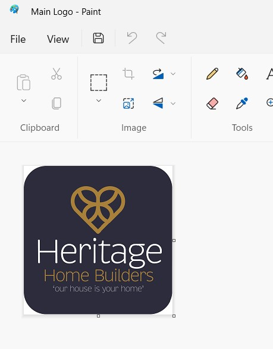
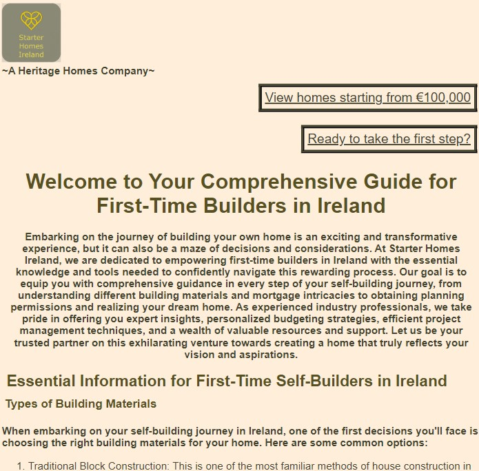
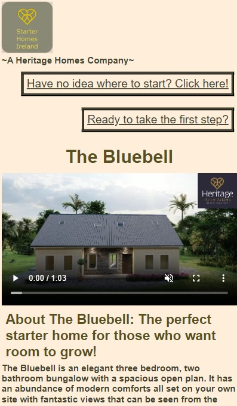
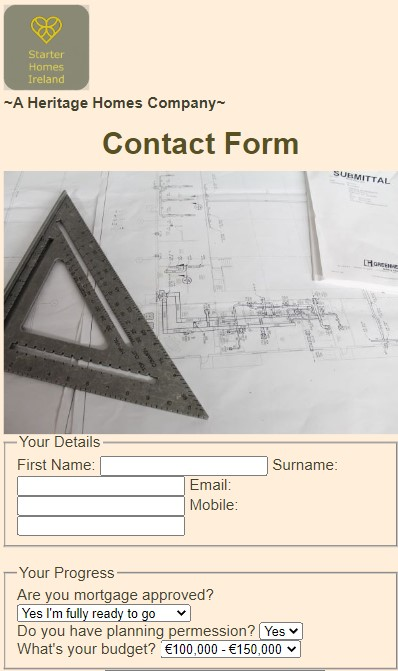
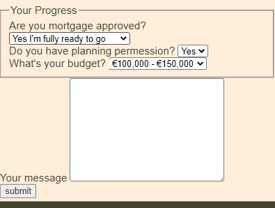
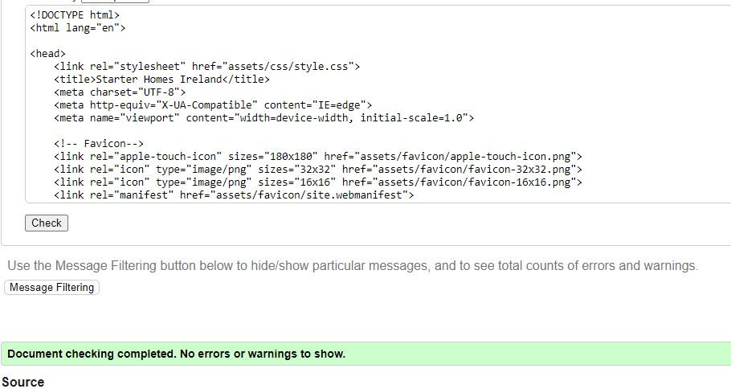
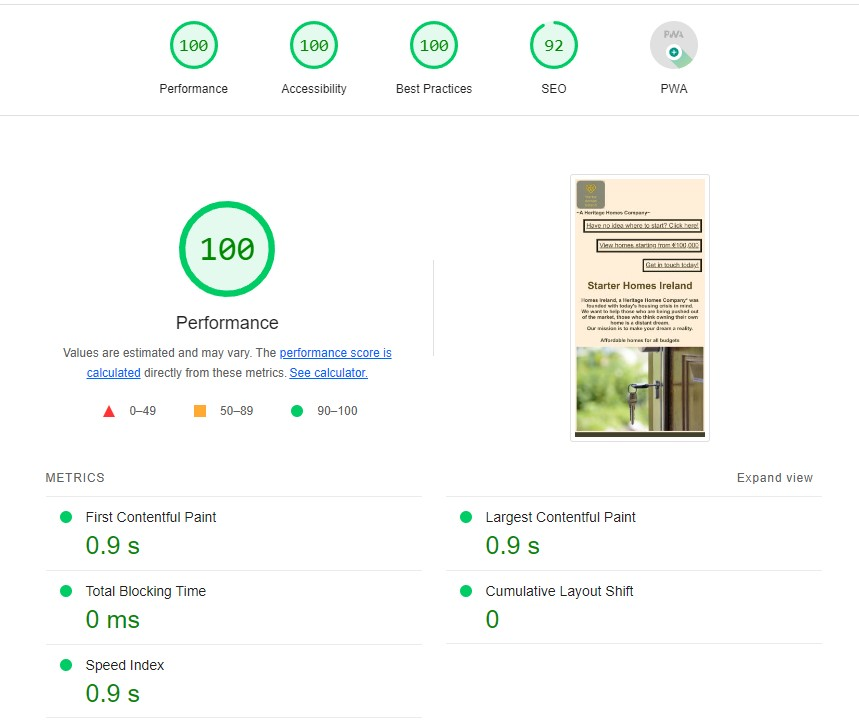
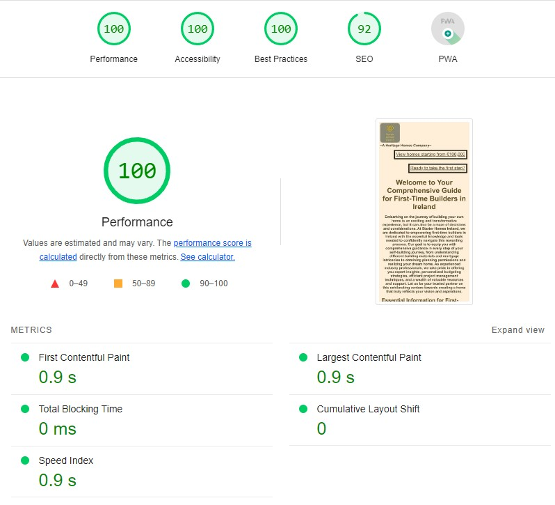

# My very first website

Welcome! [Project 1 Repository](https://github.com/Aoifeoc101/Project1)

[link to live deployed project.](<https://aoifeoc101.github.io/Project1/>)

# Goals and Objectives
My goal for this project was to create a website which catered to first time home buildrs, a page which would give them the minimal amount of information they needed when considering starting to build.

The idea is coming from a business my father is setting up called Heritage Homes Ireland. I wanted to make this website different and more suited towards younger first time buyers or builders. 

## Homepage
I wanted to keep my homepage simple, a clear image of a warming background picture of keys into a home. 
I used neutral inviting colours which I thought would appal to my target audience.

## Logo and tagline

To create the logo I used paint, I coloured out everything except the heart symbol
I then added the tagline underneath to reference the "parent" company
I used flex to get this to stick to the top left of the page 

## Navigation
In the home page I added 3 seperate internal links;
<ol>
<li>The first link is to an informarion page, I clearly labelled it "Have no idea where to start? Click here!"</li>
<li>The 2nd link leads to a page featuring one home-The Bluebell, this link is called "View homes starting from €100,000". I decided to include just one home as opposed to including many and copying the same code.</li>
<li>The 3rd link is to my contact page titled "Get in touch today!"</li>
</ol>
To ensure ease of access from page to page I included these links on each page, except for the contact page as this is the page I want people to stay on so they will provide contact details.

## Info-page

The next page I wanted to create was a general info page containing important things to know for first time builders.
To do this I used ordered lists and 3 different heading styles

## The Bluebell

The bluebell I included a video of the house. The original video was over 7 minutes long and had a quality of 1080p, however this file size was too big to run through github/ codeanywhere so I sliced the video down to 1 minute, sped the video up and also dropped the quality down to 720p in order for it to play.

I set the video width to 100% and used the flex properties to enusre the sizing was not affected by changing screen size.

Below the video I gave some information on the house itself, I used headers and unordered lists to do this
 
## Contact Form

The contact form was one of the most crucial parts, in real life when we get enquiries into the heritage homes website some just say things like "how much is this house". These kind of questions with no context or information can be frustrating. In order to combat this on my project website I added multiple fields to ensure I was capturing the most crucial information and made the important ones required fields. 

I added a textarea field so people could then choose to give me additional information. I didn't make this field required as I didn't want to put people off who didn't want to go to the time of writing a message. 

## Footer

I kept the footer very simple, I used a dark background colour and a link to the "parent" site in gold to match the logo. I used flex to maximise the size of the container to push down the footer to the bottom of the page.

# Testing

## html

## css

All code was checked and verified via w3c

## Fixed-Issues

I had a few challenges with overriding css styles. For example I had a padding of 5px applied to the * main styles. This meant that my ordered lists were not displaying the numbers. To investigate this I used chrome developer tools to see what rule was stopping the numbers from displaying.

Another issue was that display:block was applied to main, when this was applied none of my flex properties I was adding were working, again I used chrome developer tools to find what was stopping my flex styles from applying.

## Accessibility 

Below are the screenshots from lighthouse, getting accessibility to 100% was a difficiult tasks as I had to change all of my background, text and header colours to meet 100%. For this reason, my site looks different to the colours in my wireframe 

## index.html

## info-page

