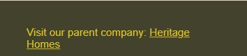

# My very first website

Welcome! [Project 1 Repository](https://github.com/Aoifeoc101/Project1)

[link to live deployed project.](<https://aoifeoc101.github.io/Project1/>)

# Goals and Objectives

## Target Audience

- My goal for this project was to create a website which catered to first time home builders.
- A page which would give them the minimal amount of information they needed when considering starting to build.

## User Goals

- The idea is coming from a business my father is setting up called Heritage Homes Ireland.
- I wanted to make this website different and more suited towards younger first time buyers or builders.

## User Stories

- I wanted people to be able to learn about the basics such as mortgage info for building and planning permission topics.
- To be able to clearly understand the different types of builds.
- To view one of our homes ie-bluebell.html and see the benefits of starting smaller and building bigger one day.
- To be able to easily reach us using a contact form which would gather the minimal information needed for a opening call.

## Wireframe

To build my wireframe I used miro.

## Initial Process

- Started with the bare html code to enter the content for the home page- index.html
- Found the way to apply € symbol using &euro;100,000 on google
- Integrated to github and started to make commits
- Created 2 new pages- Contact and Bluebell
- From here I added more features to the form
- I then added the logo and began to adjust the size
- Applied box method to relevant elements

## Homepage

I wanted to keep my homepage simple, a clear image of a warming background picture of keys into a home.

I used neutral inviting colours which I thought would appal to my target audience.

## Logo and tagline

To create the logo I used paint, I coloured out everything except the heart symbol.
I then added the tagline underneath to reference the "parent" company.
I used flex to get this to stick to the top left of the page.

## Navigation

In the home page I added 3 seperate internal links;

- The first link is to an informarion page, I clearly labelled it "Have no idea where to start? Click here!"
- The 2nd link leads to a page featuring one home-The Bluebell, this link is called "View homes starting from €100,000".
- I decided to include just one home as opposed to including many and copying the same code.
- The 3rd link is to my contact page titled "Get in touch today!"

To ensure ease of access from page to page I included these links on each page, except for the contact page as this is the page I want people to stay on so they will provide contact details.

## Info-page

The next page I wanted to create was a general info page containing important things to know for first time builders.
To do this I used ordered lists and 3 different heading styles.

## The Bluebell

The bluebell I included a video of the house. The original video was over 7 minutes long and had a quality of 1080p, however this file size was too big to run through github/ codeanywhere so I sliced the video down to 1 minute, sped the video up and also dropped the quality down to 720p in order for it to play.

I set the video width to 100% and used the flex properties to enusre the sizing was not affected by changing screen size.

Below the video I gave some information on the house itself, I used headers and unordered lists to do this.

## Contact Form

The contact form was one of the most crucial parts, in real life when we get enquiries into the heritage homes website some just say things like "how much is this house". These kind of questions with no context or information can be frustrating. In order to combat this on my project website I added multiple fields to ensure I was capturing the most crucial information and made the important ones required fields.

I added a textarea field so people could then choose to give me additional information. I didn't make this field required as I didn't want to put people off who didn't want to go to the time of writing a message.

Once the from was submitted I wanted to ensure a clear message to the user:

## Footer

I kept the footer very simple, I used a dark background colour and a link to the "parent" site in gold to match the logo. I used flex to maximise the size of the container to push down the footer to the bottom of the page.

# Testing

## html

## css

All code was checked and verified via w3c

## Fixed-Issues

I had a few challenges with overriding css styles. For example I had a padding of 5px applied to the * main styles. This meant that my ordered lists were not displaying the numbers. To investigate this I used chrome developer tools to see what rule was stopping the numbers from displaying.

Another issue was that display:block was applied to main, when this was applied none of my flex properties I was adding were working, again I used chrome developer tools to find what was stopping my flex styles from applying.

Another change I had to make was to the classes. I had been directly styling the elements which meant I had a lot of repeated code in my css file such as text-alignment and colours, I re-ordered my css as advised by my mentor which made it much easier to adjust the colours to meet the accessibilty score.

## Accessibility

Below are the screenshots from lighthouse, getting accessibility to 100% was a difficiult tasks as I had to change all of my background, text and header colours to meet 100%. For this reason, my site looks different to the colours in my wireframe

## index.html

## info-page.html

## bluebell.html

## form.html

# Credits

Code Acedemy LMS. As I went through the material on the LMS I took examples of code and saved it in my notion. I've published this page to the web so it's visible.

[HTML & CSS Notion Page](https://rift-count-d53.notion.site/HTML-CSS-df8abe7f6d35455383e6f68dfcd5dc5c?pvs=4)

[favicon](https://favicon.io/emoji-favicons/house)

[form image](https://pxhere.com/en/photo/1099461)

[Learn Flexbox CSS in 8 minutes](https://www.youtube.com/watch?v=phWxA89Dy94)

[Flexbox Notion](https://rift-count-d53.notion.site/Flexbox-7772ca4f1e0b4081bf90ce5a674b13a1)

[Original Video from Heritage Homes](https://heritagehomes.ie/designs/the-bluebell/)

[Content from bluebell.html](https://heritagehomes.ie/designs/the-bluebell/)

[Fonts from google fonts](https://fonts.google.com/)...
